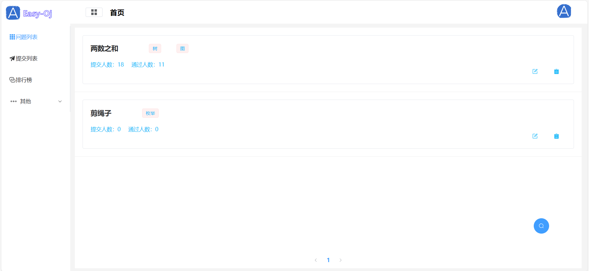
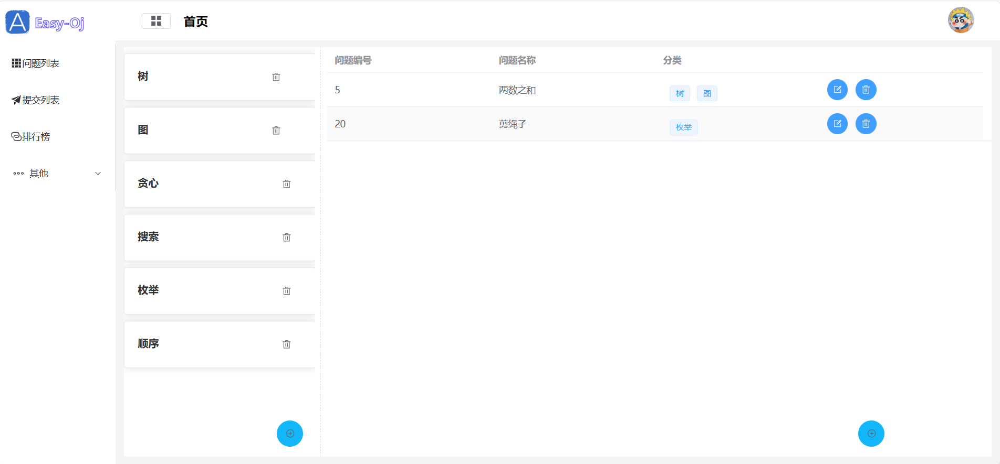
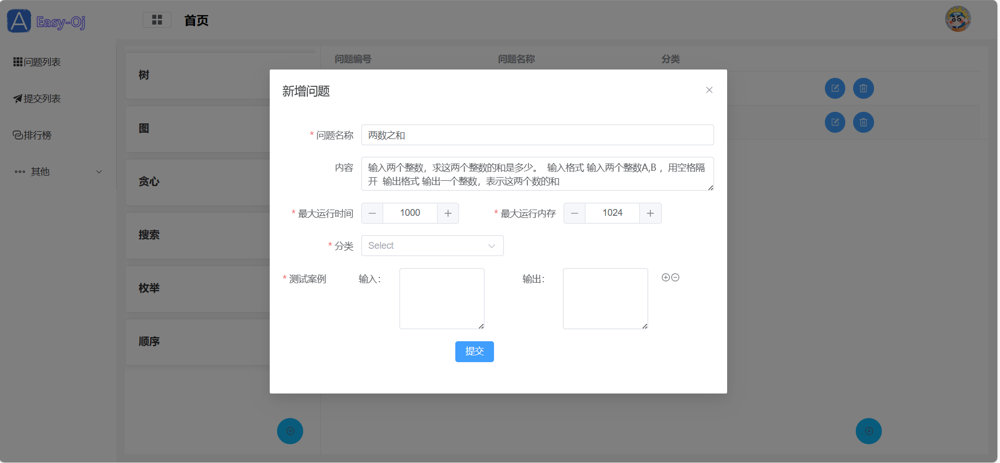
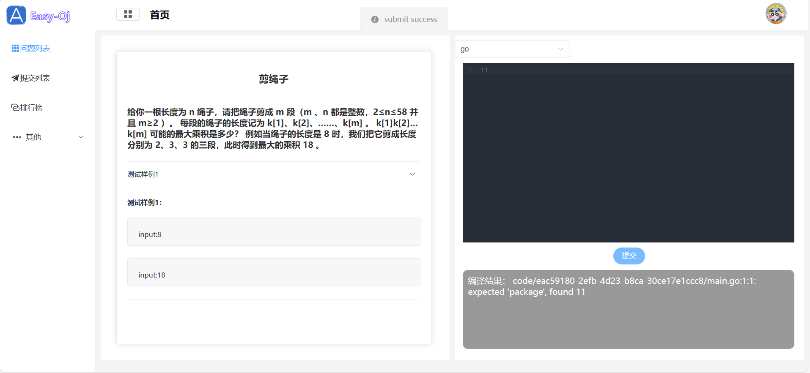
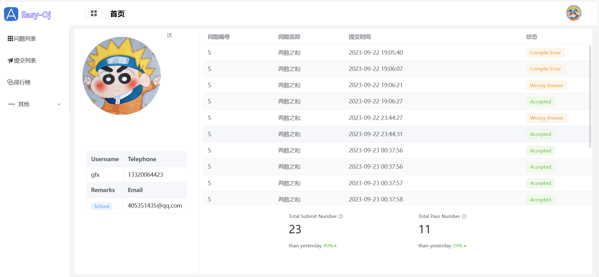

# Easy-Oj

# 项目演示

https://gfxgy.asia/
服务器在海外，访问可能有些慢



## 如何使用

### 1. 克隆模板仓库

使用以下命令克隆这个模板仓库到你的本地项目文件夹：

```bash
git clone https://github.com/gonggonggnog/Easy-OJ-WEB 
```

2. ## 进入项目文件夹

   进入项目文件夹：

   ```bash
   cd Easy-OJ-WEB
   ```

   ## 3.安装依赖

   安装项目所需的依赖：

   ```
   npm install
   ```

4. ## 开发模式

   启动开发服务器，以便你可以开始编写代码并在浏览器中实时预览：

```
npm run dev
```

5. ## 生产构建

   当你准备好部署你的应用时，使用以下命令进行生产构建：

   ```
   npm run build
   # 或者
   yarn build
   ```

   ## 6.项目打包

   ```
   npx vite build
   ```


### 注意：本项目使用的node版本为v18.17.1，如若出现问题，请试试更改node和npm版本
